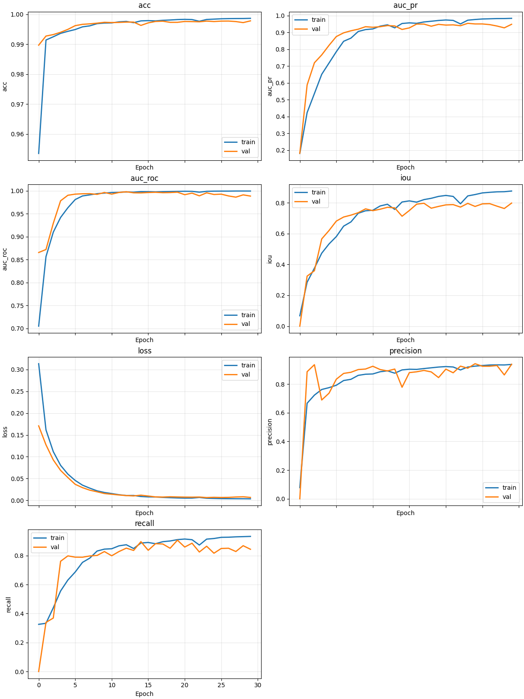
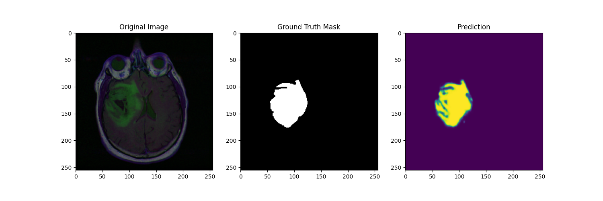
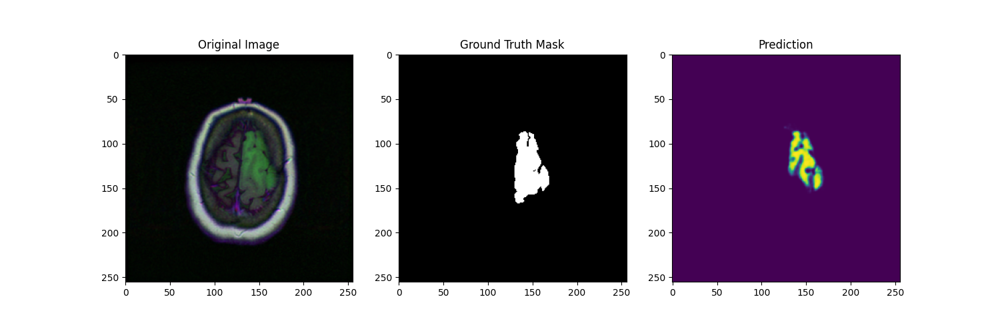
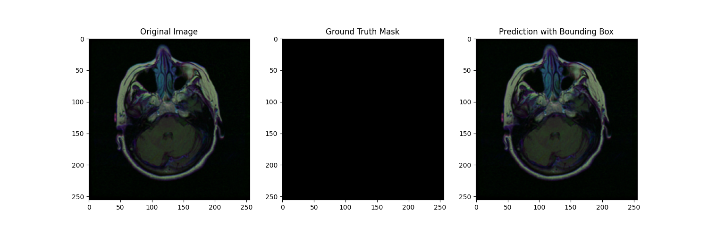
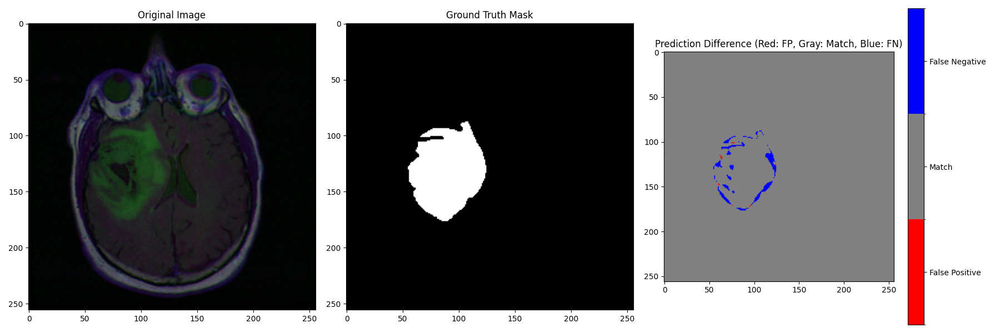
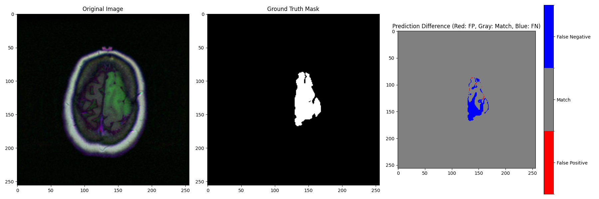
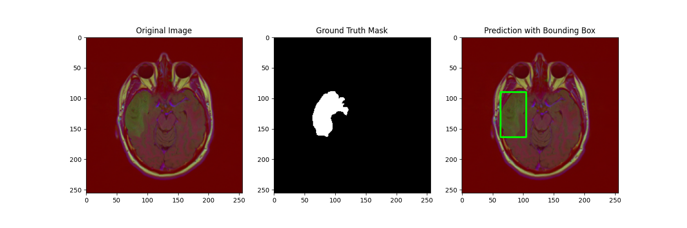

# Brain Tumor Segmentation

# Dataset
We use the [Brain MRI](https://www.kaggle.com/datasets/mateuszbuda/lgg-mri-segmentation) dataset, which consists of 3,929 samples. Each sample contains an MRI scan of a human brain along with a corresponding segmentation mask. The mask provides pixel-wise annotations, where each pixel indicates whether it belongs to tumor tissue or not.

Out of the 3,929 samples, there are 1,373 images with a tumor and 2,556 samples without a tumor.

This imbalance should be considered when choosing evaluation metrics (e.g., Dice score, IoU) and potentially when applying techniques such as class weighting or data augmentation.

The dataset is divided into:

- Training set: 80%
- Validation set: 20%

The split is performed randomly, ensuring that both subsets reflect the overall data distribution as closely as possible. Depending on the experimental setup, a stratified split (based on tumor presence) may be beneficial to preserve class balance across splits.

# Model

For the segmentation task, we use a U-Net architecture, which is a widely used convolutional neural network for biomedical image segmentation. U-Net is particularly well-suited for this task because it combines context information from deeper layers with fine-grained spatial information from earlier layers, enabling precise pixel-wise predictions. The left side of the U-Net (Encoder) works like a classical CNN, whereas the right part of the U-Net (Decoder) scales the result up to obtain the original image size with a suitable segmentation. Using skip connections allows the model to retain features at an earlier stage to reuse them in the Upscaling.

The implemented neural network is inspired by this [U-Net](https://www.kaggle.com/code/alimohamedabed/brain-tumor-segmentation-u-net-80-dice-iou#Evaluation:-Dice-Coefficient-&-IoU). We used more than a third fewer parameters, which makes this net more efficient. The implemented model takes input images of size 256 × 256 × 3 and uses a base number of 32 filters. As already mentioned, the architecture consists of two main parts:

- **Encoder**
  The encoder progressively extracts higher-level feature representations while reducing the spatial resolution. Each encoder stage contains a convolutional block with:
  - two 3×3 convolution layers
  - batch normalization
  - ReLU activation

Downsampling is performed using 2×2 max pooling. With each level, the number of feature channels is doubled.

- **Bottleneck**
At the deepest level of the network, the model learns the most compact and abstract representation of the input image.

- **Decoder**
The decoder restores the spatial resolution using 2×2 transposed convolutions. After each upsampling step, the corresponding feature maps from the encoder are concatenated via skip connections. These skip connections are essential because they preserve local image details that would otherwise be lost during downsampling.

The final layer is a 1×1 convolution with sigmoid activation, producing a single-channel segmentation mask in which each pixel represents the predicted probability of belonging to the tumor class.

A full summary of the implemented U-Net architecture, including all layers and the total number of trainable parameters, is provided in the following [figure](graphics/unet_summary.png).

# Results

The U-Net model demonstrates strong and stable convergence over 30 training epochs. Both training and validation metrics indicate that the network successfully learns to segment tumor regions with high accuracy and robust generalization.

The training process shows a consistent decrease in loss, from 0.313 → 0.0034, while the validation loss drops from 0.1707 → 0.0067. Most of the performance gains occur within the first 10 epochs, after which the model continues to improve more gradually, indicating a transition from coarse learning to fine-grained refinement.

Since pixel-wise accuracy is not very informative for highly imbalanced medical segmentation tasks, the evaluation focuses on overlap and ranking-based metrics:

- Validation IoU: up to 0.799
- Validation Precision: 0.938
- Validation Recall: 0.843
- Validation AUC-PR: up to 0.955

These results indicate that the model achieves a strong balance between detecting tumor regions and avoiding false positives, with particularly high precision. One can also observe that in the examples below.

For that reason, the model is robust in most cases, where the brain is not affected by a tumor.

For deployment or reporting, Epoch 24 is a strong candidate due to optimal validation loss and peak AUC-PR, while Epoch 30 offers the highest overlap quality.

The model achieves higher precision than recall (0.938 vs. 0.843), meaning it is conservative in predicting tumor regions:

- Low false positive rate
- Slight tendency to miss some tumor pixels

For this reason, one can observe that, very often, the boundary of the tumor is not fully detected:

 

In certain clinical workflows, coarse localization may already provide value. In most cases, it is enough to show that there is something wrong in a certain region, such that doctors and surgeons can react. In this case, one can detect those abnormalities by postprocessing the prediction and placing a bounding box on the area where a tumor is suspected. Some examples are shown below.

# Limitations
Brain tumor segmentation is inherently imbalanced, with tumor regions occupying only a small fraction of the image. In practical use, the network will overlook small tumors or tumors in early stages very likely. Even if one tumor is detected, the network indicates a tendency to miss some tumor regions (false negatives). This may be critical in clinical contexts where sensitivity is prioritized.

Evaluation is performed on a single validation split. The model’s robustness across different datasets, scanners, or patient populations is not explicitly verified.

Furthermore, the model does not explicitly leverage 3D spatial context, which may limit performance on volumetric structures.

# Further work
 For further investigation, one could test the network on rotated or noisy images to test its robustness. If the trained network performs badly on this test data, one could develop a workaround where the images are rotated in the desired direction. For noisy data one option is to dive into the theory of inverse problems to recover the original image. This will not work perfectly in any case, but it could be interesting to see how the trained network performs on recovered images. 

In addition to that, the evaluation with images from different scanners is beneficial to test robustness.

For practical use, future work could include 3D U-Nets, Dice-based loss functions, cross-dataset evaluation, and uncertainty estimation for more reliable predictions. 
