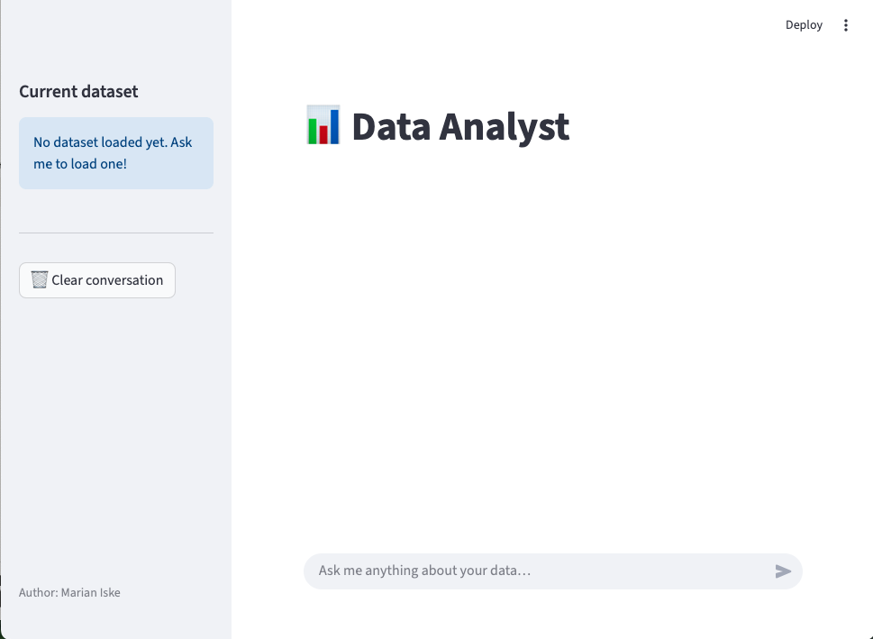
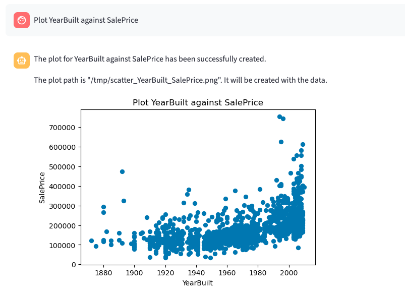

# Data Analyser
An agentic system that combines LLM reasoning with deterministic data processing tools to perform reliable data analysis (statistics, cleaning, visualization) without numerical hallucinations.

# Run Application
```bash
./run.sh
```

## Problem

LLMs are prone to hallucinate when performing exact numerical computations or data analysis tasks. While they can describe patterns well, they are not reliable for executing deterministic operations such as statistics, filtering, or transformations.

## Solution

This project implements an agent that combines an LLM with deterministic data analysis tools. The LLM is responsible for reasoning and planning, while all numerical operations are executed via controlled Python functions.

## User Interface

The project includes a Streamlit-based UI that allows users to:

- Select and load datasets
- Interact with the agent via natural language
- Inspect tool calls and execution traces
- Visualize results (tables and plots)



## Architecture

```
DataAnalyzer/
├── app.py              # Streamlit UI
├── agent/
│   ├── LLM.py          # Agent loop & tool orchestration
│   ├── ToolRegistry.py # Tool registration & execution
│   └── helpers.py      # Dataset tools (pure functions)
├── eval/
│   ├── eval.py         # Evaluation runner
│   └── test_cases.py   # Evaluation test cases
└── tests/
    └── pytests_LLM.py  # Unit tests (pytest)
```

## Agent loop

The core of the project is the `LLM` class in `agent/LLM.py`. It runs an agentic loop: the user sends a message, the model responds either with a final answer or with one or more tool calls. If the model calls a tool, the result is appended to the conversation and the model gets another turn. This repeats until the model produces a plain-text answer or the step limit is reached.

```
User message
    │
    ▼
┌─────────────────────────────┐
│  Select relevant tools      │  ← context-aware pre-filtering
└────────────┬────────────────┘
             │
             ▼
┌─────────────────────────────┐
│  Ollama chat (functiongemma)│
└────────────┬────────────────┘
             │
     ┌───────┴────────┐
     │ tool calls?    │
    yes               no
     │                │
     ▼                ▼
┌─────────┐      Final answer
│ Execute │
│  tools  │
└────┬────┘
     │
     └──► append result → next step
```

All tool calls and results are recorded in `last_run_trace` so the UI and evaluator can inspect what happened in each turn.

## Tool routing

Passing every registered tool to the model on every turn wastes context and confuses the model. Instead, the agent pre-filters tools based on the current state:

- **No dataset loaded** — only the two navigation tools (`find_dataset`, `list_datasets`) are passed to the model, completely eliminating the confusion between *load* and *list*.
- **Dataset loaded** — the agent computes cosine similarity between the user query and each tool's description. It first tries Ollama's own embedding API; if that fails, it falls back to TF-IDF character n-grams. Only tools above a relative similarity threshold are passed to the model.

This makes routing language-agnostic and synonym-tolerant without any hardcoded keyword lists.

## Tools

Tools are registered in `ToolRegistry` and implemented as pure functions in `helpers.py` that take a `pd.DataFrame` plus optional parameters and return a plain `dict`. This keeps the analysis logic completely decoupled from the LLM and easy to unit-test.

| Tool | Description |
|---|---|
| `find_dataset` | Fuzzy-matches a user query to an available dataset and loads it via KaggleHub |
| `list_datasets` | Lists all available datasets |
| `get_info` | Shape, column names, dtypes, missing-value counts |
| `describe_dataset` | Descriptive statistics (count, mean, std, min/max, category summaries) |
| `calc_mean_column` | Mean of a single numeric column |
| `scatter_plot` | Scatter plot saved as PNG, path returned for the UI to render |
| `pca_feature_selection` | PCA on all numeric columns, returns explained variance and component preview |
| `filter_outliers` | Robust z-score outlier removal |
| `normalize` | Z-score normalization of all numeric columns |
| `missing_values_report` | Missing count and percentage per column |
| `column_type_report` | Dtype, unique count, and example value per column |
| `correlation_report` | Pearson / Spearman / Kendall correlation matrix |
| `categorical_summary` | Top-N value counts for each categorical column |
| `duplicate_report` | Duplicate row count and percentage |


## Prompt examples

### Basic dataset exploration

**User Prompt**
> Load the Fraud detection dataset and give me basic information.

**What happens**
- find_dataset → Fraud detection dataset
- get_info → collects information

**Output (excerpt)**
The basic information for the Fraud detection dataset is as follows:

Dataset Name: Fraud detection Rows: 339607 Columns: 15 Categorized Columns: trans_date_trans_time, merchant, category, city, state, job, DOB, trans_num, mercch_lat, mercch_long, is_fraud **Numeric Columns:**amt, lat, long, city_pop, merchant, state, job, DOB, trans_num, merch_lat, merch_long, is_fraud

### Data cleaning + analysis

**User Prompt**
> Load the Fraud detection dataset, remove outliers, and then normalize the data.

**What happens**
- load_dataset
- filter_outliers
- normalize

**Output (excerpt)**
The dataset "Fraud detection" has been successfully loaded. It contains 339607 rows with 15 columns and 15 entries. The dataset was loaded successfully.

One can see all the tools in the Tool calls.

### Visualization


## Evaluation

The project includes both unit tests and behavioral evaluations:

- **Unit tests** verify correctness of individual tools
- **Evaluation suite** tests:
  - correct tool selection
  - avoidance of hallucinated numerical results
  - response structure and consistency

## Limitations

- Limited set of analysis tools
- Visualization capabilities are basic
- No support for user-uploaded datasets 

## Further work
- Built more helpful, specific data analysis tools for certain datasets
- Allow to upload own datasets
