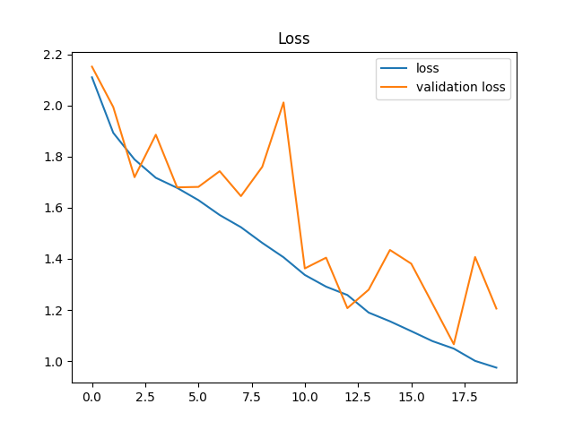
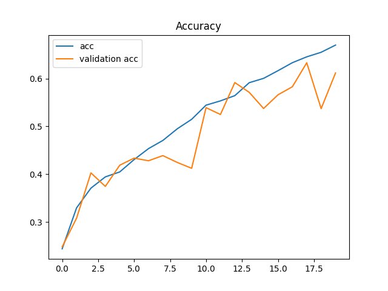
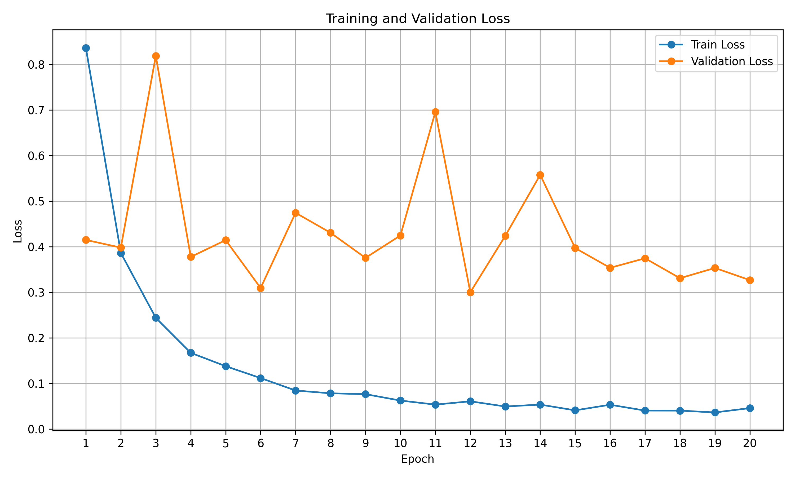
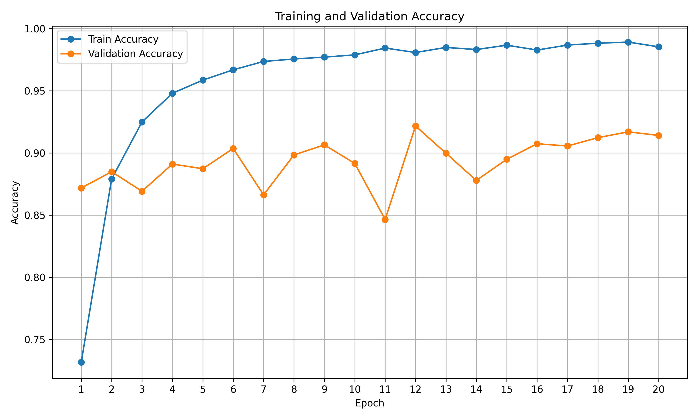
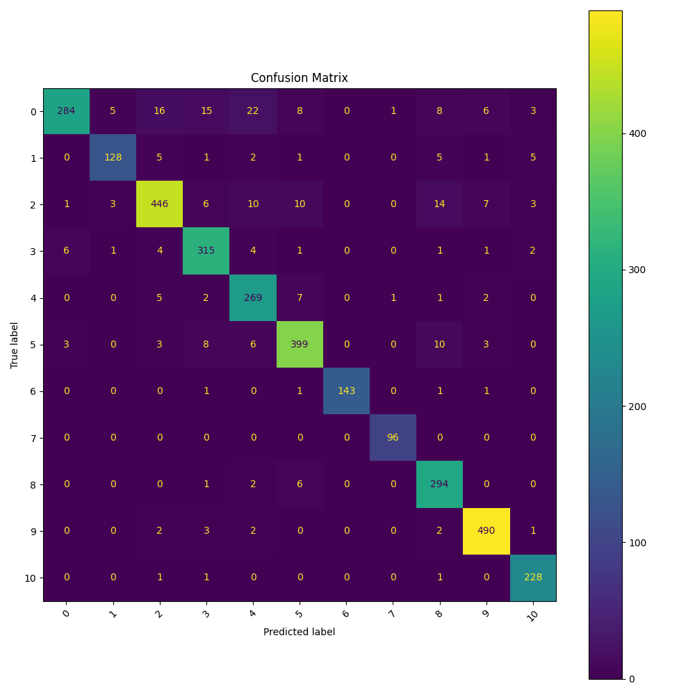
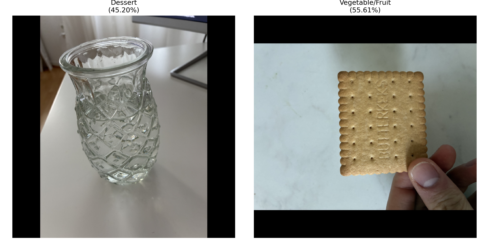

# Food Classifier

# Dataset
I used the dataset [Food-11](https://www.kaggle.com/datasets/vermaavi/food11). The Food-11 dataset is a multiclass food image classification dataset containing 16,643 images grouped into 11 broad food categories: Bread, Dairy products, Dessert, Egg, Fried food, Meat, Noodles/Pasta, Rice, Seafood, Soup, and Vegetable/Fruit. An example of some data is represented here: 
The dataset is divided into training (9,866 images), validation (3,430 images), and evaluation (3,347 images) subsets. Since the class distribution is imbalanced, Food-11 is particularly suitable for investigating transfer learning, data augmentation, and class imbalance issues in image classification.

# Model
I chose a compact CNN because it is expressive enough to learn relevant visual features such as textures, shapes, and color patterns, while remaining small enough to generalize well on the Food-11 dataset. The architecture uses convolutional blocks with increasing channel depth to build hierarchical feature representations, from simple edges to more class-specific food structures. Batch normalization, max pooling, and dropout improve training stability, reduce overfitting, and make the model more robust to visual variation. Global average pooling was used instead of a large fully connected head to reduce the number of parameters and improve generalization on unseen validation images. 

The custom CNN showed slow convergence and limited performance, indicating insufficient representational capacity:

To address this, a pretrained ResNet50 was used to leverage transfer learning and improve feature extraction.

# Results

Final validation accuracy: 58.4%
ResNet50 validation accuracy: 91.7%

The post-training of the ResNet converged much faster:
 

One can see that the accuracy is high very quickly and the loss is decreasing. In the confusion matrix, one can see that 84 images of the class bread are misclassified. A reason for that is that in some pictures are burgers or pizzas depicted, which could also be recognized as vegetable or meat. This appears a couple of times in the food-11 dataset. One can see already in the example images that some images are not clearly assignable to one class.

I also created pictures of a "Leibniz Butterkeks" and a glass of water which is shaped like a pineapple. 

The network is not confident in its predictions, which is a good sign since none of those classes exist. I would have assumed that the Butterkeks should be predicted as a bread due to its color but the network assigns higher probabilty to the class vegetable or fruit, which can be explained by its shape. The pineapple glass is classified as a dessert, which can also be explained by its shape.

# Limitations

- The classification task is relatively simple due to the low number of classes.
- Model lacks fine-grained feature discrimination.

# Further work
Further work could include creating feature maps or activation maps so that the classification of the additional images can be explained.
