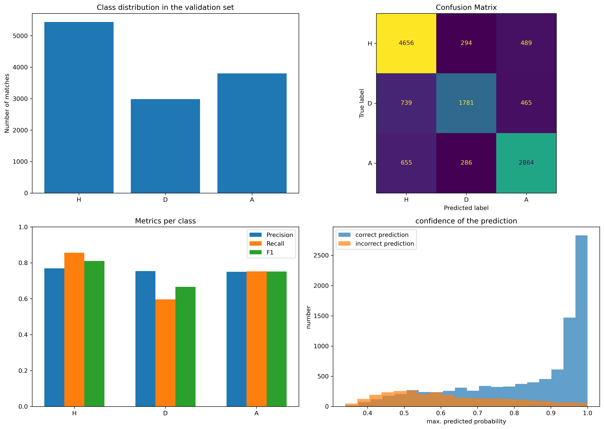

# Portfolio
This is my portfolio to show my practical skills.

## Click on a project name in the table to look at it in more detail.

# Projects
| Project | Area | Description and Results |
|------|--------------|-------|
|Food Image Classification||coming soon|
|Segmentation of Medical Images||coming soon|
[Predicting Football matches](XGBoosting)| Data Pipeline, XGBoost, Statistics, probability-based multiclass prediction, interpretation of model behavior|This project demonstrates my understanding of XGBoost, statistical modeling, and building a small end-to-end data pipeline for football match prediction. The model reached an accuracy of 76% on the validation data set. You can see more specified statistics below, where H/A means win for the home/away team and D means draw.|
|Automatic E-Mail Responder||coming soon|
|Portfolio Trader||coming soon|
