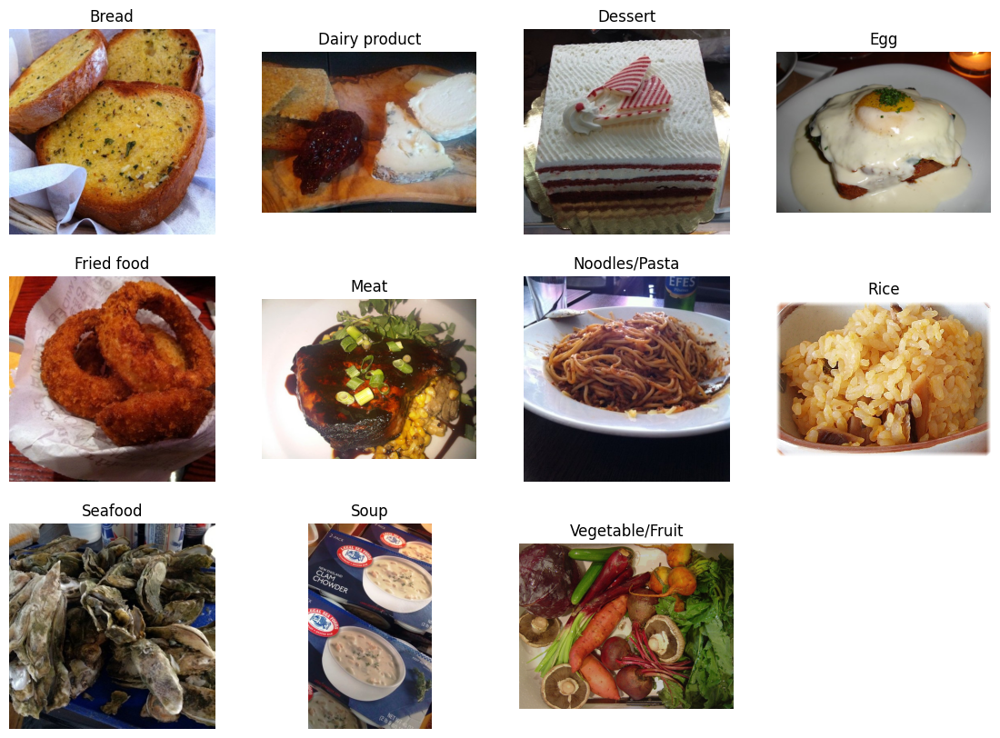
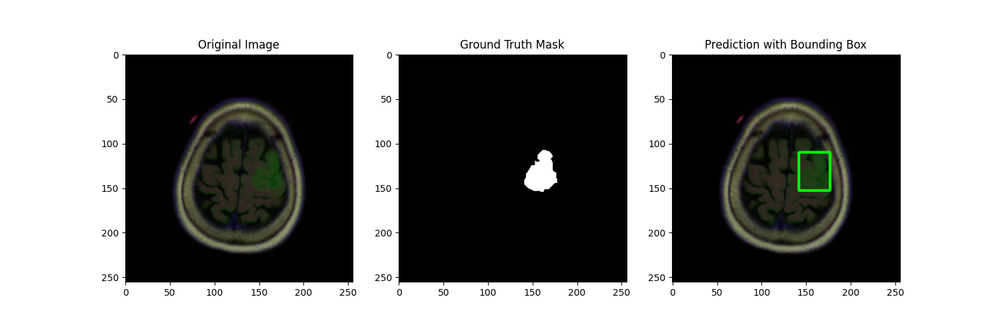

# Portfolio
This is my portfolio to show my practical skills.

## Click on a project name in the table to look at it in more detail.

# Projects
| Project | Area | Description and Results |
|------|--------------|-------|
|[Food Image Classification](FoodImageClassifier)|Computer Vision, Deep Learning, Neural Network, Convolutional Neural Network, ResNet, Transfer Learning, PyTorch, Regularization, Model Evaluation, Class Imbalance, Model Interpretation, Failure Analysis|This project shows my ability to develop and train an image classifier on an imbalanced dataset for a challenging classification task. Some samples are visually ambiguous and cannot be cleanly associated with a single category, as you can see in the example images below:  First of all I created a CNN inspired by the LeNet5 model. Due to the slow convergence of this model, I used the pretrained ResNet50 to improve convergence and overall performance. This model achieved **92,3%** accuracy on the evaluation set after only 10 training epochs.|
|[Brain Tumor Segmentation](BrainTumorSegmentation) | Deep Learning, Computer Vision, Medical Image Segmentation, Semantic Segmentation, U-Net (En-/ Decoder Net), Biomedical Imaging, Pixel-wise Prediction | Implemented a U-Net for pixel-wise brain tumor segmentation on MRI data (3,929 samples). Addressed class imbalance (1,373 tumor vs. 2,556 non-tumor) and achieved strong performance (IoU: 0.799, Precision: 0.938, Recall: 0.843, AUC-PR: 0.955). Model uses a parameter-efficient architecture (>30% fewer parameters than baseline) and demonstrates robust generalization, with postprocessing for clinically relevant tumor localization. An example is shown here: |
[Predicting Football matches](XGBoosting)| Data Pipeline, XGBoost, Statistics, probability-based multiclass prediction, interpretation of model behavior, sklearn|This project demonstrates my understanding of XGBoost, statistical modeling, and building a small end-to-end data pipeline for football match prediction. The model reached an accuracy of **76%** on the validation data set. You can see more specified statistics below, where H/A means win for the home/away team and D means draw.|
|[Data Analyzer](DataAnalyzer)|LLM, RAG, pytests, UI, Data analysis, Streamlit, Embeddings|Built an LLM-powered data analysis agent that combines language model reasoning with deterministic data processing tools to avoid numerical hallucinations. The system implements an agentic loop with dynamic tool routing based on embedding similarity, enabling multi-step workflows such as data loading, cleaning, statistical analysis, and visualization. Includes a Streamlit UI for interactive use and an evaluation suite to verify correct tool selection and robustness. |
|Portfolio Trader|Reinforcment Learning|coming soon|
